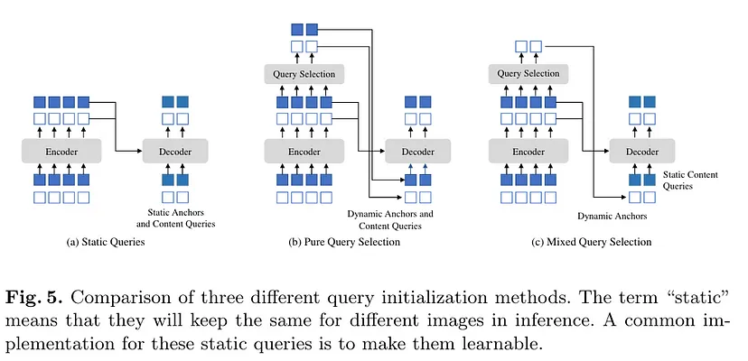

# GroundingDINO-Re-implementation

Project for the Computer Vision Course academic year 2023/2024 at Sapienza Università di Roma
Objective of the project is to re-implement the GroundingDINO paper found at the link: https://arxiv.org/pdf/2303.05499

## TODO

- Tokenize special tokens -> ["[CLS]", "[SEP]", ".", "?"]
- Masking special tokens to avoid gradient computation?

### Input and Output shapes from the authors Repo

[link](https://github.com/IDEA-Research/GroundingDINO/blob/main/groundingdino/models/GroundingDINO/groundingdino.py)

```python
The forward expects a NestedTensor, which consists of:
- samples.tensor: batched images, of shape [batch_size x 3 x H x W]
- samples.mask: a binary mask of shape [batch_size x H x W], containing 1 on padded pixels

It returns a dict with the following elements:
- "pred_logits": the classification logits (including no-object) for all queries.
                Shape= [batch_size x num_queries x num_classes]
- "pred_boxes": The normalized boxes coordinates for all queries, represented as
                (center_x, center_y, width, height). These values are normalized in [0, 1],
                relative to the size of each individual image (disregarding possible padding).
                See PostProcess for information on how to retrieve the unnormalized bounding box.
- "aux_outputs": Optional, only returned when auxilary losses are activated. It is a list of
                dictionnaries containing the two above keys for each decoder layer.
```

## Query Selection Methods

How to select queries from the `Language-Guided Query Selection` Module to be used in the `Decoder` Module?  
There are three main query selection methods used in transformer-based object detection models: `Static Queries`, `Pure Query` Selection, and `Mixed Query` Selection. Each method has its own approach to initializing decoder queries, leveraging encoder features, and balancing between static and dynamic components.


[Link](https://www.google.com/url?q=https%3A%2F%2Fmedium.com%2F%40gagatsis94%2Fdino-detr-with-improved-denoising-anchor-boxes-for-end-to-end-object-detection-4f32b9389baa%23%3A%7E%3Atext%3Dthe%2520matching%2520part.-%2CMixed%2520query%2520selection%2C-Figure%2520adapted%2520from)

### Static Queries

In the static query method, both positional and content queries are learned during training and remain the same for all images during inference. This method is straightforward but lacks the adaptability to individual images.

```python
import torch
import torch.nn as nn

class StaticQuerySelection(nn.Module):
    """
    Static query selection for initializing decoder queries.
    
    Attributes:
        num_queries (int): Number of queries.
        embed_dim (int): Dimension of the query embeddings.
    """
    def __init__(self, num_queries, embed_dim):
        super(StaticQuerySelection, self).__init__()
        self.num_queries = num_queries
        self.embed_dim = embed_dim
        
        # Learnable content and positional queries
        self.queries = nn.Parameter(torch.randn(num_queries, embed_dim))

    def forward(self, batch_size):
        """
        Forward pass to get static queries.
        
        Args:
            batch_size (int): Size of the batch.
        
        Returns:
            torch.Tensor: Static queries of shape (batch_size, num_queries, embed_dim)
        """
        return self.queries.unsqueeze(0).expand(batch_size, -1, -1)

# Example usage
batch_size = 32
num_queries = 100
embed_dim = 256

static_query_selector = StaticQuerySelection(num_queries, embed_dim)
static_queries = static_query_selector(batch_size)

print("Shape of static queries:", static_queries.shape)
```

### Pure Query Selection

In pure query selection, top-K features from the encoder are selected and transformed to generate both positional and content queries dynamically for each image.

```python
class PureQuerySelection(nn.Module):
    """
    Pure query selection for initializing decoder queries.
    
    Attributes:
        num_queries (int): Number of queries.
        embed_dim (int): Dimension of the query embeddings.
        top_k (int): Number of top encoder features to select.
    """
    def __init__(self, embed_dim, num_queries, top_k):
        super(PureQuerySelection, self).__init__()
        self.embed_dim = embed_dim
        self.num_queries = num_queries
        self.top_k = top_k
        
        # Linear layers to transform encoder features
        self.positional_linear = nn.Linear(embed_dim, embed_dim)
        self.content_linear = nn.Linear(embed_dim, embed_dim)

    def forward(self, encoder_features):
        """
        Forward pass to get pure queries.
        
        Args:
            encoder_features (torch.Tensor): Features from the encoder of shape (batch_size, num_tokens, embed_dim)
        
        Returns:
            torch.Tensor: Pure queries of shape (batch_size, num_queries, embed_dim)
        """
        # Select top-K features from encoder
        top_k_features, _ = torch.topk(encoder_features, self.top_k, dim=1)
        
        # Generate positional and content queries
        positional_queries = self.positional_linear(top_k_features)
        content_queries = self.content_linear(top_k_features)
        
        # Combine positional and content queries
        queries = positional_queries + content_queries
        
        return queries

# Example usage
batch_size = 32
num_tokens = 200
encoder_features = torch.randn(batch_size, num_tokens, embed_dim)
pure_query_selector = PureQuerySelection(embed_dim, num_queries, top_k=10)
pure_queries = pure_query_selector(encoder_features)

print("Shape of pure queries:", pure_queries.shape)
```

### Mixed Query Selection

Mixed query selection combines static learnable content queries with dynamically selected positional queries from the top-K encoder features. This hybrid approach aims to leverage the strengths of both static and dynamic methods.

```python
class MixedQuerySelection(nn.Module):
    """
    Mixed query selection for initializing decoder queries.
    
    Attributes:
        embed_dim (int): Dimension of the query embeddings.
        num_queries (int): Number of queries.
        top_k (int): Number of top encoder features to select.
    """
    def __init__(self, embed_dim, num_queries, top_k):
        super(MixedQuerySelection, self).__init__()
        self.embed_dim = embed_dim
        self.num_queries = num_queries
        self.top_k = top_k
        
        # Learnable content queries
        self.content_queries = nn.Parameter(torch.randn(num_queries, embed_dim))
        
        # Linear layer to transform encoder features for positional queries
        self.positional_linear = nn.Linear(embed_dim, embed_dim)

    def forward(self, encoder_features):
        """
        Forward pass to get mixed queries.
        
        Args:
            encoder_features (torch.Tensor): Features from the encoder of shape (batch_size, num_tokens, embed_dim)
        
        Returns:
            torch.Tensor: Mixed queries of shape (batch_size, num_queries, embed_dim)
        """
        batch_size = encoder_features.size(0)
        
        # Select top-K features from encoder
        top_k_features, _ = torch.topk(encoder_features, self.top_k, dim=1)
        
        # Generate positional queries from top-K features
        positional_queries = self.positional_linear(top_k_features)
        
        # Expand content queries for batch
        content_queries = self.content_queries.unsqueeze(0).expand(batch_size, -1, -1)
        
        # Combine positional and content queries
        mixed_queries = torch.cat([positional_queries, content_queries], dim=1)
        
        return mixed_queries

# Example usage
batch_size = 32
num_tokens = 200
encoder_features = torch.randn(batch_size, num_tokens, embed_dim)
mixed_query_selector = MixedQuerySelection(embed_dim, num_queries, top_k=10)
mixed_queries = mixed_query_selector(encoder_features)

print("Shape of mixed queries:", mixed_queries.shape)
```

### Comparison and Recommendation

- **Static Queries**: Simple and efficient but lacks adaptability to different images.
- **Pure Query Selection**: Dynamically selects queries from encoder features, providing better image-specific queries, but might introduce noise if selected features contain multiple objects.
- **Mixed Query Selection**: Combines the strengths of static and dynamic approaches by using static content queries and dynamic positional queries. This provides robust and adaptable queries, leveraging both pre-learned content features and image-specific positional information.

**Recommendation**: Mixed Query Selection is generally the best approach as it balances the robustness of static queries with the adaptability of dynamic queries, leading to improved performance in tasks like object detection and referring expression comprehension.


